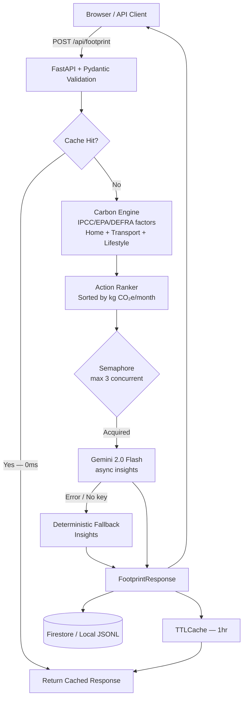

# 🌱 Carbon Footprint Awareness Platform

**PromptWars 2026 — Challenge 3**

> *Design a solution that helps individuals understand, track, and reduce their carbon footprint through simple actions and personalised insights.*

**Live on Google Cloud Run:** https://promptwars-agent-w5jjhm6mwa-uc.a.run.app

---

## What This Does

The Carbon Footprint Awareness Platform is a production-ready web application that:

1. **Understands** your lifestyle (home energy, transport, food, and purchasing habits)
2. **Calculates** a transparent monthly CO₂e estimate using published IPCC/EPA/DEFRA emission factors
3. **Ranks** personalised reduction actions by estimated monthly impact
4. **Explains** your results using Gemini AI in non-judgmental, practical language
5. **Compares** your footprint to global benchmarks (India average, world average, Paris 1.5°C target)

---

## Google Services Used

| Google Service | Role in this Platform | Why it was chosen |
|---|---|---|
| **Gemini 2.0 Flash** (`google-genai` SDK) | Generates 3 personalised, grounded insights per assessment | Fastest Gemini model; async API avoids blocking the event loop |
| **Google Cloud Run** | Hosts the containerised FastAPI backend | Fully serverless, scales to zero, no infrastructure management |
| **Google Cloud Firestore** | Persists assessments in production (`FIRESTORE_ENABLED=true`) | Native async client, real-time capable, integrates with Cloud IAM |
| **Google Cloud Logging** | Structured JSON logs forwarded to Cloud Logging | Replaces print(); enables log-based alerting and dashboards |
| **Google Secret Manager** | Stores `GEMINI_API_KEY` in production | Zero secrets in code or env files in Cloud Run |

---

## Architecture



---

## Features

| Layer | What it does |
|---|---|
| **Config** | `pydantic-settings` `BaseSettings` — all env vars centralised, never scattered `os.getenv()` |
| **Cache** | `cachetools.TTLCache` — SHA-256 keyed, pre-seeded at startup; repeat requests return in < 1 ms |
| **Rate Limiter** | `asyncio.Semaphore(3)` — caps concurrent Gemini calls, prevents `429 Resource Exhausted` |
| **API Service** | Async FastAPI — all endpoints `async def`, non-blocking I/O throughout |
| **AI Engine** | Gemini 2.0 Flash (async SDK); deterministic fallback always works without API key |
| **Carbon Engine** | Transparent factor-based calculations with `lru_cache` on pure lookups |
| **Storage** | Async Firestore (production) or `asyncio.to_thread` local JSONL (development) |
| **Security** | Non-root Dockerfile (`appuser`), strict CORS allowlist, 6 security headers including CSP + HSTS |
| **Deployment** | Dockerfile + Cloud Run PowerShell script + service YAML |
| **Tests** | 57 passing tests across 4 files: unit, integration, config, edge cases, cache, and API boundary tests |

---

## Local Development

```powershell
# Create and activate virtual environment
python -m venv .venv
.\.venv\Scripts\Activate.ps1

# Install dependencies
pip install -r requirements.txt

# Optional: configure Gemini
copy .env.example .env
# Edit .env and add your GEMINI_API_KEY

# Run development server
uvicorn app.main:app --reload
```

Open **http://127.0.0.1:8000** — the API and service work without a Gemini key using deterministic fallback insights.

---

## Tests

```powershell
pytest tests\ -v
```

Expected: **57 passed** across four test files (`test_api.py`, `test_carbon.py`, `test_insights.py`, `test_config.py`).

---

## Configuration

| Variable | Default | Description |
|---|---|---|
| `GEMINI_API_KEY` | _(empty)_ | Gemini API key — app falls back gracefully if missing |
| `GEMINI_MODEL` | `gemini-2.0-flash` | Override the Gemini model |
| `GOOGLE_CLOUD_PROJECT` | _(required for deploy)_ | GCP project ID |
| `GOOGLE_CLOUD_REGION` | `us-central1` | Cloud Run region |
| `FIRESTORE_ENABLED` | `false` | Set `true` to persist assessments in Firestore |
| `LOCAL_DATA_DIR` | system temp | Local JSONL storage path for development |
| `ALLOWED_ORIGINS` | localhost ports | Comma-separated allowed CORS origins — never `*` |
| `MAX_CONCURRENT_LLM_CALLS` | `3` | Semaphore cap for concurrent Gemini requests |
| `CACHE_MAX_SIZE` | `256` | Maximum number of cached responses |
| `CACHE_TTL_SECONDS` | `3600` | Cache time-to-live in seconds |

Copy `.env.example` to `.env` for local development. **Never commit real secrets.**

---

## Cloud Run Deployment

```powershell
$env:GOOGLE_CLOUD_PROJECT = "your-project-id"
$env:GOOGLE_CLOUD_REGION  = "us-central1"
.\scripts\deploy-cloud-run.ps1 -AllowUnauthenticated
```

See [`docs/google-cloud-run.md`](docs/google-cloud-run.md) for full setup including Secret Manager for the Gemini key and optional Firestore persistence.

---

## Documentation

| Document | Contents |
|---|---|
| [`docs/architecture.md`](docs/architecture.md) | System design, data flow, Mermaid diagram, agent decision logic |
| [`docs/tool-usage.md`](docs/tool-usage.md) | All Google tools used and why each was selected |
| [`docs/prompt-engineering.md`](docs/prompt-engineering.md) | Prompt iterations from initial to final optimised version |
| [`docs/human-ai-responsibilities.md`](docs/human-ai-responsibilities.md) | Clear separation of human vs AI roles |
| [`docs/scoring-checklist.md`](docs/scoring-checklist.md) | PromptWars judging criteria self-assessment |
| [`docs/security-check.md`](docs/security-check.md) | Security audit report, threat model, and dependency analysis |
| [`docs/google-cloud-run.md`](docs/google-cloud-run.md) | Deployment prerequisites and step-by-step guide |
| [`docs/linkedin-post-draft.md`](docs/linkedin-post-draft.md) | Draft social post for submission validation |

---

## Emission Factors (Key References)

- Transport: DEFRA 2023 GHG Conversion Factors
- Electricity: India CEA Grid Emission Factor 2022-23 (0.71 kg CO₂e/kWh)
- Diet: Poore & Nemecek (2018), Oxford University food systems research; Scarborough et al. 2023, Nature Food
- Gas: EPA AP-42 combustion factors
- Goods and waste: EPA WARM model lifecycle averages

---

## Why AI Is Necessary

Raw carbon numbers alone do not change behaviour. The platform uses Gemini to:

1. **Interpret** ambiguous lifestyle inputs in context of the user's goal
2. **Prioritise** the highest-impact action in language matched to the user's motivation
3. **Phrase** recommendations without guilt, in the user's own goal framing (save money vs. reduce emissions)
4. **Personalise** each insight using real calculated data — no hallucinated claims

The deterministic engine ensures correctness; Gemini ensures engagement and personalisation.
