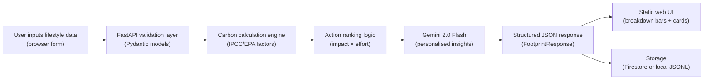

# Architecture

## Problem

Individuals often know climate change matters, but they lack clarity on which daily activities emit the most CO₂, how their footprint compares to others, and what concrete steps they can take. This platform converts common lifestyle inputs into a transparent, category-by-category monthly footprint estimate and delivers personalised actions small enough to start immediately.

## Target Users

- Students and young professionals seeking practical sustainability guidance.
- Families comparing home energy, transport, and lifestyle choices.
- Community organisations running carbon awareness programmes.
- Anyone who wants a quick, honest, non-judgmental baseline estimate.

## Why AI Is Necessary

Carbon data alone does not change behaviour. Gemini provides three capabilities that deterministic logic cannot:

1. **Contextualised phrasing** — Insights reference the user's name, country, and stated goal, making advice feel personal rather than generic.
2. **Motivational framing** — The AI adapts tone to the user's goal (save money vs. build habits vs. reduce emissions).
3. **Ambiguity resolution** — The system instruction prevents the model from making unsupported claims, while allowing it to reason about the relative importance of actions.

## System Flow

## Components

| Component | File(s) | Role |
|---|---|---|
| Frontend / Input layer | `static/index.html`, `static/app.js`, `static/styles.css` | User data entry, animated result display, educational content |
| Backend / API layer | `app/main.py` | FastAPI routing, CORS, OpenAPI schema |
| Data models | `app/models.py` | Pydantic validation, enum types, field bounds |
| Carbon engine | `app/carbon.py` | Factor-based CO₂e calculation, action generation, confidence scoring |
| LLM layer | `app/insights.py` | Gemini adapter with system instruction + deterministic fallback |
| Storage layer | `app/storage.py` | Firestore (production) or local JSONL (development) |
| Deployment | `Dockerfile`, `scripts/`, `deploy/` | Cloud Run container and service config |

## Agent Decision Logic

1. **Receive** structured lifestyle input from the browser form.
2. **Validate** all fields with Pydantic — reject invalid inputs before any calculation.
3. **Estimate** home energy, transport, and lifestyle emissions separately using published factors.
4. **Identify** high-impact areas using threshold checks (e.g., car_km > 30, electricity_kwh > 150).
5. **Generate** candidate actions with estimated monthly savings and effort ratings.
6. **Rank** actions by impact descending, capped at 4.
7. **Prompt** Gemini with the validated profile, category totals, and ranked actions — grounded strictly in calculated data.
8. **Fall back** to deterministic insights if Gemini is unavailable or returns insufficient content.
9. **Store** the assessment for future trend tracking.
10. **Return** structured JSON consumed by the frontend to render bars, cards, and insights.

## Confidence Scoring

The confidence score (0–0.92) estimates how much detail was provided:

| Signal | Added weight |
|---|---|
| Baseline (diet + home) | 0.72 |
| Transport data supplied | +0.08 |
| Household size > 1 | +0.04 |
| Renewable % > 0 | +0.04 |
| Meals out or new items > 0 | +0.04 |
| Natural gas usage > 0 | +0.02 |
| Maximum cap | 0.92 |

The cap at 0.92 acknowledges inherent uncertainty in lifestyle-based CO₂e estimation.

## Sequential Thinking MCP Usage

The Sequential Thinking MCP server was used during development for:

- Breaking down the problem statement into implementation phases.
- Reviewing prompt iterations before settling on the final system instruction.
- Architecture review checkpoints at each layer.
- Pre-submission deployment verification planning.

This MCP server was run locally via `npx` during development, and did not affect runtime behaviour of the deployed service.
