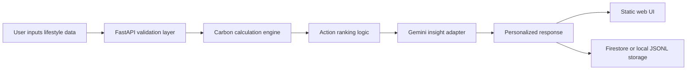

# Architecture

## Problem

Individuals often know climate change matters, but they do not know which daily activities matter most or what to do next. This platform converts common lifestyle inputs into a transparent monthly carbon footprint estimate and returns personalized actions that are small enough to start immediately.

## Target Users

- Students and young professionals who want practical sustainability guidance.
- Families comparing transport, home energy, and lifestyle choices.
- Community groups running awareness drives and workshops.

## Why AI Is Necessary

Carbon data alone is not enough. Users need a system that can interpret ambiguous lifestyle inputs, prioritize the highest-impact category, and phrase recommendations in a personal, non-judgmental way. Gemini is used for personalized explanation when an API key is configured, while deterministic calculations keep the platform reliable and testable.

## System Flow

## Components

- Frontend: Static HTML, CSS, and JavaScript served by FastAPI.
- Backend/API: FastAPI endpoints for health checks and footprint estimation.
- LLM layer: Gemini adapter in `app/insights.py`, with deterministic fallback when no key is available.
- Tool execution layer: Carbon factor calculations and action ranking in `app/carbon.py`.
- Storage layer: Firestore when `FIRESTORE_ENABLED=true`, otherwise local JSONL for development.
- Deployment layer: Dockerfile and Cloud Run deployment script.

## Agent Decision Logic

1. Validate user inputs with Pydantic.
2. Estimate home, transport, and lifestyle emissions separately.
3. Identify the highest-impact areas and generate candidate actions.
4. Rank actions by estimated monthly savings.
5. Ask Gemini for concise personalized insights if configured.
6. Fall back to local insights if Gemini or network access is unavailable.
7. Store the assessment for trend tracking.

## Sequential Thinking MCP Usage

The repository includes `mcp.json` with the Sequential Thinking MCP server. It is intended for planning, prompt refinement, architecture review, and deployment checks in MCP-capable clients.

This implementation keeps user-facing reasoning concise and does not expose hidden chain-of-thought. Documentation and commits capture high-level checkpoints instead.
